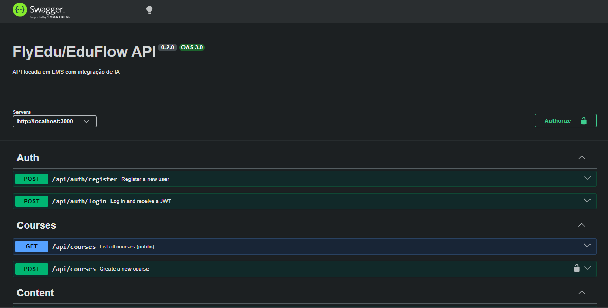
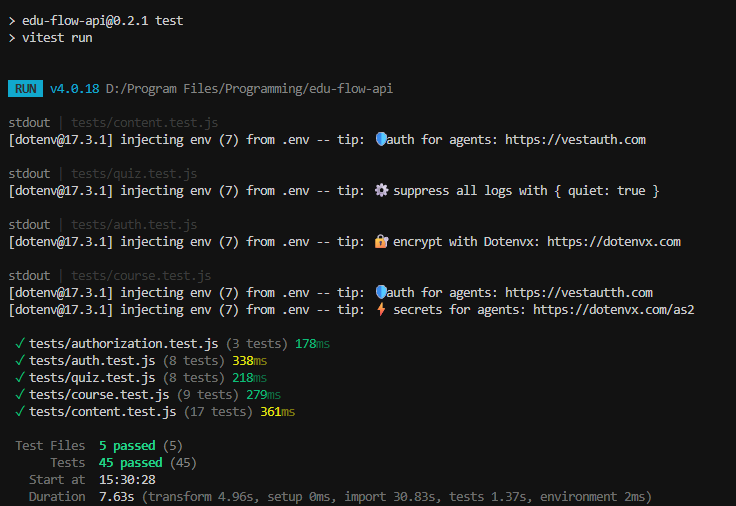

# 🚀 EduFlow API

<p align="center">
  
  
  
</p>

<p align="center">
  <!-- TECH STACK -->
  
  
  
  
  
  
  
  
</p>

<p align="center">
  
</p>

---

<p align="center">
  <a href="#-versão-em-português">🇧🇷 Ler em Português</a>
</p>

# 🇺🇸 English Version

## 📌 Overview

**EduFlow API** is a robust headless backend engineered to power Learning Management Systems (LMS). Originally architected as the core engine for **FlyEdu** (my full-stack educational platform), it extracts complex business logic, AI integrations, and RBAC security into a scalable, standalone REST API.

It manages users, courses, and nested content while leveraging **Generative AI** to automate the creation of educational assessments.

- **Problem solved:** Reduces the time instructors spend creating quizzes and manages complex educational hierarchies with high security.
- **Who it is for:** EdTechs and platforms looking for a secure, AI-ready foundation for online courses.

---

## 🎯 Project Goal

This project was built to demonstrate advanced backend engineering skills, including:

- **Database Architecture:** Complex relational modeling with PostgreSQL.
- **Security:** Strict authorization flows (RBAC).
- **AI Integration:** Real-world use case of LLMs (Google Gemini `gemini-2.5-flash-lite`) in a production-ready API.
- **DevOps:** Dockerized database service via `docker-compose` for isolated local development, while the Node.js backend runs natively.

---

## ✨ Features

- 🔐 **Secure Authentication:** JWT-based login and registration.
- 🛡️ **RBAC (Role-Based Access Control):** Specific permissions for Instructors and Students.
- 📚 **Course Management:** Hierarchical structure (Courses -> Modules -> Lessons).
- 🤖 **AI-Powered Quiz:** Automated generation of quizzes based on lesson content using Google Gemini (`gemini-2.5-flash-lite`).
- 📜 **Interactive Documentation:** Full API documentation with Swagger.
- 🧪 **Automated Testing:** Integration tests with Vitest and Supertest.

---

## 🏗 Architecture

The project follows a **Layered Architecture** (Repository Pattern) to ensure separation of concerns and maintainability.

```
src/
 ├── config/       # Database and Swagger configurations
 ├── controllers/  # Request handling and response logic
 ├── services/     # Business logic and AI integrations
 ├── repositories/ # Direct database access (SQL queries)
 ├── routes/       # API endpoint definitions
 ├── middlewares/  # Auth and validation layers
 └── docs/         # OpenAPI/Swagger specifications
```

---

## 🛠 Tech Stack

### Backend & AI

- **Node.js & Express:** Core framework for building the scalable REST API and handling asynchronous requests.
- **Google Generative AI (Gemini):** Powers the core intelligent feature. Implementation uses the `gemini-2.5-flash-lite` model via `@google/generative-ai`.

### Database & DevOps

- **PostgreSQL:** Chosen for complex relational data modeling (Courses -> Modules -> Lessons) and its native `JSONB` support for storing dynamic quiz data.
- **Docker & Docker Compose:** `docker-compose.yml` provisions a PostgreSQL service for local development; the backend is started with `npm start` (not containerized by default).

### Quality, Security & Docs

- **Vitest & Supertest:** Modern, fast integration testing to ensure endpoint reliability and proper DB mocking.
- **Swagger (OpenAPI 3.0):** Interactive, self-hosted API documentation (`/api-docs`) for easy frontend integration.
- **JWT & bcryptjs:** Stateless authentication, secure password hashing, and Role-Based Access Control (RBAC).

---

## 🔐 Security

- **Authentication:** Stateless JWT (JSON Web Token) strategy.
- **Password Handling:** Secure hashing using `bcryptjs`.
- **Role Control:** Middleware-level verification to prevent unauthorized content creation.
- **Environment:** Sensitive data managed via `.env` (included `.env.example`).

---

## 📦 Installation

```bash
# Clone the repository
git clone <repository-url>

# Install dependencies
npm install

# Setup environment variables
cp .env.example .env

# Start the database and services (Docker required)
docker compose up -d

# Run the project
npm start

# Run tests
npm test
```

---

## 📡 API Routes

| Method | Route                                 | Description                              |
| ------ | ------------------------------------- | ---------------------------------------- |
| POST   | `/api/auth/register`                  | User registration                        |
| POST   | `/api/auth/login`                     | Authentication & Token generation        |
| GET    | `/api/courses`                        | List all available courses               |
| POST   | `/api/courses`                        | Create a new course (Instructor only)    |
| GET    | `/api/courses/:id/content`            | Get full course tree (Modules + Lessons) |
| POST   | `/api/courses/lessons/:lessonId/quiz` | Generate AI quiz for a specific lesson   |

---

## 🧪 Quality & Testing

The API includes a comprehensive integration test suite covering **45 critical scenarios**, including authentication flows, RBAC-protected routes, and mocked AI generation. Tests are implemented using Vitest and Supertest to validate endpoints and database interactions.

Run the tests:

```bash
npm test
```

Generate a coverage report:

```bash
npm run test:coverage
```

The suite is designed to run on CI with the database and AI mocks configured.

<p align="center">
  
</p>

---

## 🧪 Future Improvements

- [ ] Implementation of Refresh Token Rotation.
- [ ] File upload for video lessons using AWS S3 or Supabase Storage.
- [ ] Gamification system (XP and Badges for students).

---

## 👨‍💻 Author

**Gabriel Nascimento**  
Backend Developer / Focus on AI & Scalable Systems

---

## 📄 License

This project is licensed under the MIT License.

---

---

# 🇧🇷 Versão em Português

## 📌 Visão Geral

A **EduFlow API** é um backend 'headless' robusto projetado para impulsionar Sistemas de Gestão de Aprendizagem (LMS). Originalmente arquitetada como o motor principal do **FlyEdu** (minha plataforma educacional full-stack), ela extrai regras de negócio complexas, integrações com IA e segurança RBAC para uma API REST escalável e independente.

A API gerencia usuários, cursos e conteúdos aninhados, utilizando **IA Generativa** para automatizar a criação de avaliações educacionais.

- **Problema resolvido:** Reduz o tempo que instrutores gastam criando quizzes e gerencia hierarquias educacionais complexas com alta segurança.
- **Para quem é:** EdTechs e plataformas que buscam uma base segura e pronta para IA.

---

## 🎯 Objetivo do Projeto

Este projeto foi construído para demonstrar habilidades avançadas de engenharia backend, incluindo:

- **Arquitetura de Banco de Dados:** Modelagem relacional complexa com PostgreSQL.
- **Segurança:** Fluxos rígidos de autorização (RBAC).
- **Integração com IA:** Caso de uso real de LLMs (Google Gemini) em uma API profissional.
- **DevOps:** `docker-compose.yml` provisiona um serviço PostgreSQL para desenvolvimento local; o backend é iniciado com `npm start` (não está containerizado por padrão).

---

## ✨ Funcionalidades

- 🔐 **Autenticação Segura:** Registro e login baseados em JWT.
- 🛡️ **RBAC (Controle de Acesso):** Permissões específicas para Instrutores e Alunos.
- 📚 **Gestão de Conteúdo:** Estrutura hierárquica (Cursos -> Módulos -> Lições).
- 🤖 **Quiz com IA:** Geração automática de quizzes baseada no conteúdo da aula usando Google Gemini (`gemini-2.5-flash-lite`).
- 📜 **Documentação Interativa:** Documentação completa da API com Swagger.
- 🧪 **Testes Automatizados:** Testes de integração com Vitest e Supertest.

---

## 🏗 Arquitetura

O projeto segue uma **Arquitetura em Camadas** (Repository Pattern) para garantir separação de responsabilidades.

```
src/
 ├── config/       # Configurações de Banco e Swagger
 ├── controllers/  # Lógica de recebimento de requisições
 ├── services/     # Regras de negócio e integração com IA
 ├── repositories/ # Acesso direto ao banco (Queries SQL)
 ├── routes/       # Definição dos endpoints
 ├── middlewares/  # Camadas de autenticação e validação
 └── docs/         # Especificações OpenAPI/Swagger
```

---

## 🛠 Tecnologias

### Backend & IA

- **Node.js & Express:** Framework base para a construção da API REST escalável e gerenciamento de requisições assíncronas.
- **Google Generative AI (Gemini):** Motor da funcionalidade inteligente. A implementação utiliza o modelo `gemini-2.5-flash-lite` via `@google/generative-ai`.

### Banco de Dados & DevOps

- **PostgreSQL:** Escolhido pela modelagem relacional complexa (Cursos -> Módulos -> Aulas) e suporte nativo a `JSONB` para armazenar os dados dos quizzes.
- **Docker & Docker Compose:** Containerização para garantir um ambiente de desenvolvimento local isolado e fácil de reproduzir.

### Qualidade, Segurança & Docs

- **Vitest & Supertest:** Testes de integração modernos e rápidos para garantir a confiabilidade das rotas.
- **Swagger (OpenAPI 3.0):** Documentação interativa da API (`/api-docs`) para facilitar a integração com o frontend.
- **JWT & bcryptjs:** Autenticação stateless, hash seguro de senhas e Controle de Acesso Baseado em Cargos (RBAC).

---

## 🔐 Segurança

- **Autenticação:** Estratégia Stateless via JWT.
- **Senhas:** Criptografia via `bcryptjs`.
- **Controle de Acesso:** Verificação via middleware para impedir criação de conteúdo não autorizada.
- **Ambiente:** Dados sensíveis via `.env`.

---

## 📦 Instalação

```bash
# Clonar o repositório
git clone <url-do-repositorio>

# Instalar dependências
npm install

# Configurar variáveis de ambiente
cp .env.example .env

# Subir banco de dados (Requer Docker)
docker compose up -d

# Executar projeto
npm start

# Executar testes
npm test
```

---

## 📡 Rotas da API

| Método | Rota                                  | Descrição                               |
| ------ | ------------------------------------- | --------------------------------------- |
| POST   | `/api/auth/register`                  | Registro de usuário                     |
| POST   | `/api/auth/login`                     | Login e geração de Token                |
| GET    | `/api/courses`                        | Listar todos os cursos                  |
| POST   | `/api/courses`                        | Criar novo curso (Apenas Instrutor)     |
| GET    | `/api/courses/:id/content`            | Obter árvore do curso (Módulos + Aulas) |
| POST   | `/api/courses/lessons/:lessonId/quiz` | Gerar quiz via IA para uma aula         |

---

## 🧪 Qualidade & Testes

A API possui uma suíte de testes de integração abrangente cobrindo **45 cenários críticos**, incluindo fluxos de autenticação, proteção de rotas (RBAC) e simulação da geração de IA via mocks. Os testes utilizam Vitest e Supertest para validar endpoints e interações com o banco de dados.

Executar os testes:

```bash
npm test
```

Relatório de cobertura:

```bash
npm run test:coverage
```

Recomenda-se executar a suíte no CI com o banco e os mocks de IA configurados.

<p align="center">
  
</p>

---

## 🧪 Melhorias Futuras

- [ ] Implementação de Refresh Token Rotation.
- [ ] Upload de arquivos de vídeo para aulas (AWS S3 ou Supabase).
- [ ] Sistema de gamificação (XP e Badges para alunos).

---

## 👨‍💻 Autor

**Gabriel Nascimento**  
Desenvolvedor Backend / Foco em IA e Sistemas Escaláveis

---

## 📄 Licença

Este projeto está sob a licença MIT.
